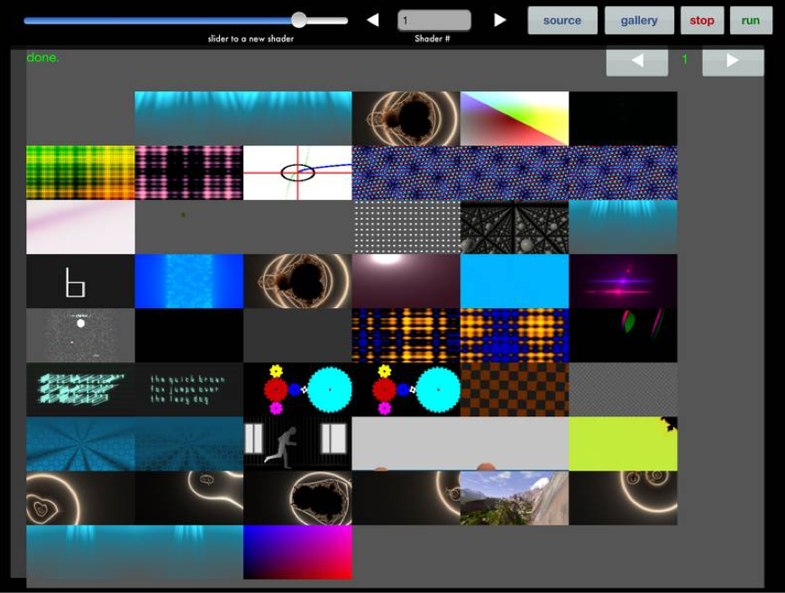
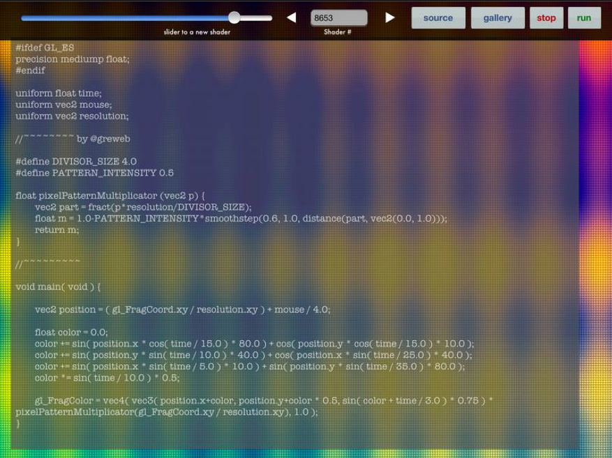
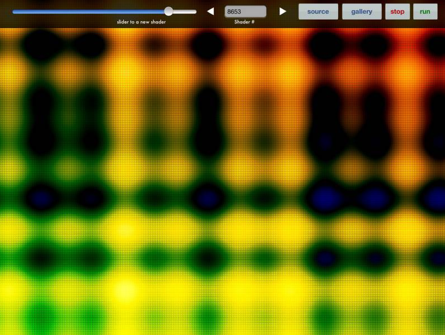

### Shadertoy - GLSL glsl.heroku.com shader runner
=========

About this project:

This is a fork from openkava that I modified a bit in order to make it work on iPad, and also added a rudimentary gallery view
and source editor to help me learn openGL / shader language.

Upon load, it will retrieve the gallery images from http://glsl.heroku.com which is a bit slow because the images are in html source and base64 encoded, the conversion to UIImage takes longer than I would have expected.

Then you can select a shader from the gallery, run it, edit it, run again.

It is a very rough cut, alpha level software but it does run shaders that were made to run on glsl.heroku.com.
Many of the shaders on the heroku sandbox need more firepower than the ipad provides, and thus the frame rate is really slow on some.
Some will not compile, and there is is little protection against bad shader source coming in from the web.

But for the most part it is something that will run a lot of different shaders, and load the source for you to edit and tweak to your hearts content.

Here are some screenshots:

